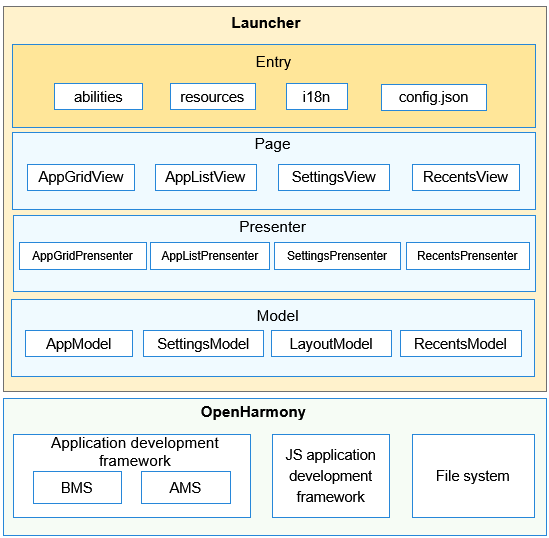

# 桌面<a name="ZH-CN_TOPIC_0000001103554544"></a>

-   [简介](#section11660541593)
    -   [架构图](#section78574815486)

-   [目录](#section161941989596)
-   [相关仓](#section1371113476307)

## 简介<a name="section11660541593"></a>

桌面作为系统人机交互的首要入口，提供应用图标的显示、点击启动、卸载应用，以及桌面布局设置、最近任务管理等功能。

### 架构图<a name="section78574815486"></a>



## 目录<a name="section161941989596"></a>

```
/applications/standard/launcher/
├── figures                  # 架构图目录
├── launcher                 # 桌面主Ability，提供应用图标的显示、点击启动、卸载应用、桌面布局设置
│   └── src
│       └── main
│           ├── config.json  # 全局配置文件
│           ├── js           # js代码目录
│           └── resources    # 资源配置文件存放目录
├── recents                  # 最近任务Ability，提供最近任务管理
│   └── src
│       └── main
│           ├── config.json  # 全局配置文件
│           ├── js           # js代码目录
│           └── resources    # 资源配置文件存放目录
├── signature                # 证书文件目录
├── LICENSE                  # 许可文件
```

## 相关仓<a name="section1371113476307"></a>

系统应用

**applications\_standard\_launcher**
